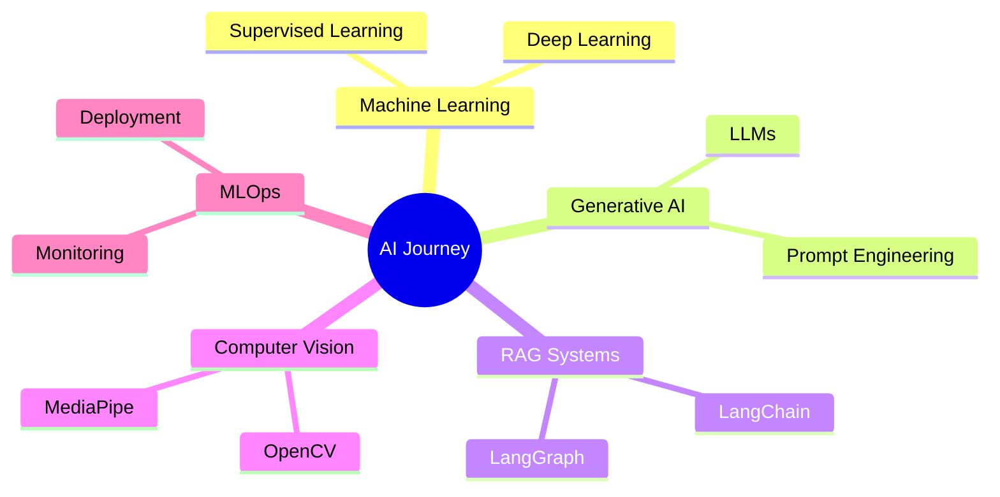

<p align="center">
  
</p>

<h3 align="center">
Artificial Intelligence & Machine Learning Student
</h3>

<p align="center">
Building intelligent systems, exploring Generative AI, and transforming ideas into impactful applications.
</p>

<p align="center">
  <a href="mailto:bowsickdharan@gmail.com">
    
  </a>
  <a href="https://github.com/bowsii">
    
  </a>
</p>

---

## Profile

```yaml
Name: Bowsickdharan
Location: Coimbatore, Tamil Nadu
Education: B.Tech Artificial Intelligence & Machine Learning
Institution: Sri Shakthi Institute of Engineering and Technology
Year: Third Year
CGPA: 8.16

Focus Areas:
  - Machine Learning
  - Generative AI
  - Retrieval-Augmented Generation
  - Computer Vision
  - Natural Language Processing

Current Goal:
  Building production-ready AI applications
```

---

## Tech Ecosystem

### Languages

<p align="left">

</p>

### Artificial Intelligence & Data Science

<p align="left">

</p>

<p align="left">


</p>

### Generative AI Stack

<p align="left">


</p>

### Databases

<p align="left">

</p>

```text
MySQL      → Relational Database Design & Queries
PostgreSQL → Advanced SQL & Data Management
MongoDB    → NoSQL Document-Oriented Storage
```

### Tools

<p align="left">

</p>

---

## Featured Projects

### Voice Assistant

AI-powered voice assistant capable of understanding commands, responding intelligently, and automating tasks using speech-based interaction.

**Technology Stack**

`Python` `NLP` `Speech Recognition` `Machine Learning`

---

### Multilingual Study Assistant

Educational AI assistant that supports multilingual interaction and helps students learn concepts through intelligent responses.

**Technology Stack**

`Python` `LLMs` `NLP` `Generative AI`

---

### Retrieval-Augmented Generation (RAG)

Context-aware question-answering system that combines document retrieval and large language models for accurate responses.

**Technology Stack**

`LangChain` `LangGraph` `Python` `Vector Search`

---

## Learning Roadmap



---

## Interests

* Artificial Intelligence
* Machine Learning
* Computer Vision
* Generative AI
* Large Language Models
* Retrieval-Augmented Generation
* Intelligent Agents
* Software Development

---

## Philosophy

> "Technology becomes meaningful when it transforms ideas into solutions that create real-world impact."

<p align="center">
  
</p>
