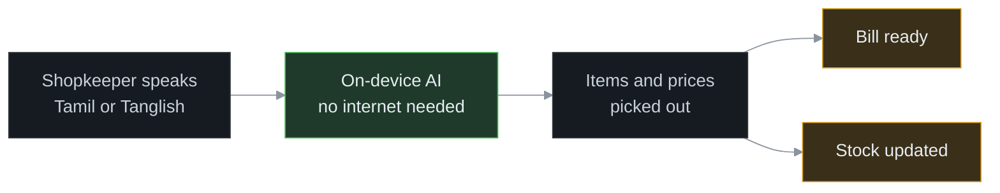
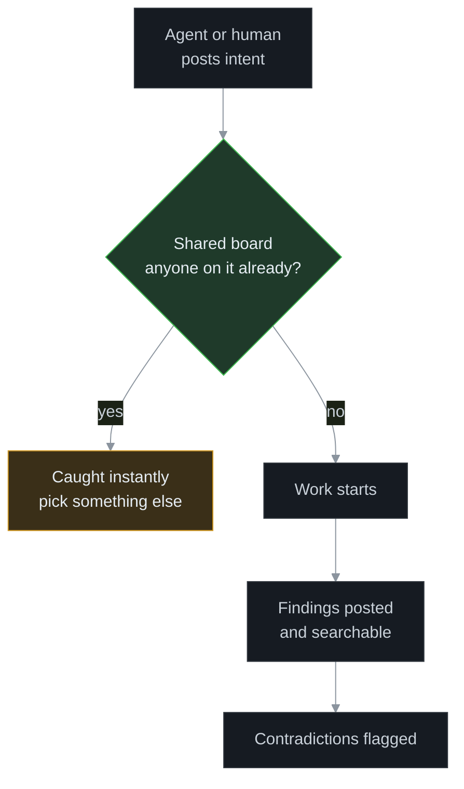
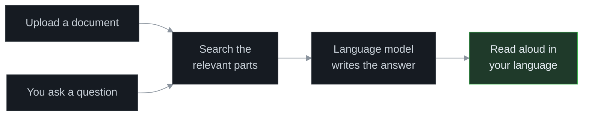
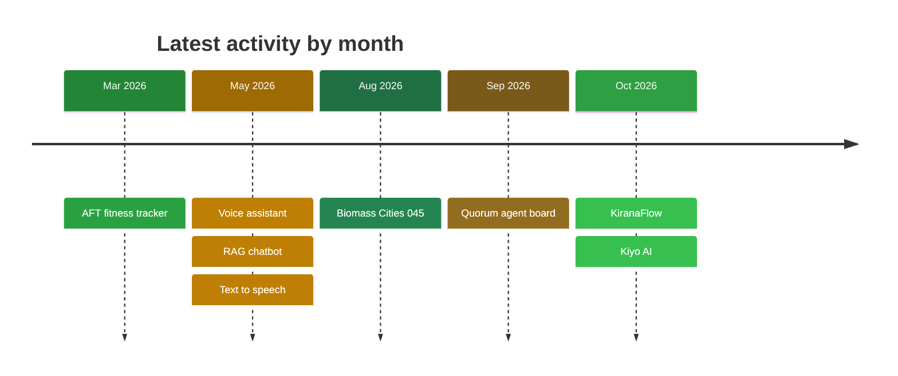

<div align="center">


<a href="https://github.com/bowsii">
  
</a>

<br/>

[](#about)
[](#projects)
[](#how-it-works)
[](#toolkit)
[](#stats)
[](#contact)

<br/>


</div>

<a id="about"></a>


<table>
<tr>
<td width="200" align="center" valign="top">

<br/><br/>
<code>he/him</code><br/>
<code>Coimbatore, India</code>
</td>
<td valign="top">

```yaml
name:      Bowsickdharan
studying:  B.Tech Artificial Intelligence & Machine Learning
college:   Sri Shakthi Institute of Engineering and Technology
year:      3rd
cgpa:      8.16
guild:     Studio Hexraei
focus:
  - Generative AI and RAG
  - Agents and multi-agent systems
  - Computer vision and NLP
  - Voice and local-language apps
goal:      production-ready AI apps, not demos
```

</td>
</tr>
</table>

> *"Technology becomes meaningful when it transforms ideas into solutions that create real-world impact."*

Right now I am building a document Q&A app that talks back in several languages, a voice-controlled billing app for small shops, and a shared board where AI agents coordinate with a person.


<a id="projects"></a>


<div align="center">

<a href="https://github.com/bowsii/Kirana-Flow"></a>
<a href="https://github.com/bowsii/Quorum-Moss-x-Zero-Latency"></a>

<a href="https://github.com/bowsii/BIOMASS-CITIES-045"></a>
<a href="https://github.com/bowsii/RAG"></a>


*Kiyo AI answers questions from your documents and reads the answer back in a language and voice you choose.*

</div>


<a id="how-it-works"></a>


<details open>
<summary><b>KiranaFlow</b>: say the bill, get the bill</summary>


```mermaid
%%{init: {'theme':'base','themeVariables':{'primaryColor':'#161B22','primaryBorderColor':'#30363D','primaryTextColor':'#C9D1D9','lineColor':'#8B949E','fontFamily':'monospace'}}}%%
flowchart LR
  A["Shopkeeper speaks<br/>Tamil or Tanglish"] --> B["On-device AI<br/>no internet needed"]
  B --> C["Items and prices<br/>picked out"]
  C --> D["Bill ready"]
  C --> E["Stock updated"]
  classDef hot fill:#1F3A2A,stroke:#3FB950,color:#E6EDF3
  classDef gold fill:#3A2F18,stroke:#D29922,color:#E6EDF3
  class B hot
  class D,E gold
```

</details>

<details>
<summary><b>Quorum</b>: agents that do not repeat each other's work</summary>


```mermaid
%%{init: {'theme':'base','themeVariables':{'primaryColor':'#161B22','primaryBorderColor':'#30363D','primaryTextColor':'#C9D1D9','lineColor':'#8B949E','fontFamily':'monospace'}}}%%
flowchart TD
  A["Agent or human<br/>posts intent"] --> B{"Shared board<br/>anyone on it already?"}
  B -- yes --> C["Caught instantly<br/>pick something else"]
  B -- no --> D["Work starts"]
  D --> E["Findings posted<br/>and searchable"]
  E --> F["Contradictions flagged"]
  classDef hot fill:#1F3A2A,stroke:#3FB950,color:#E6EDF3
  classDef gold fill:#3A2F18,stroke:#D29922,color:#E6EDF3
  class B hot
  class C gold
```

</details>

<details>
<summary><b>Kiyo AI</b>: ask your documents, hear the answer</summary>


```mermaid
%%{init: {'theme':'base','themeVariables':{'primaryColor':'#161B22','primaryBorderColor':'#30363D','primaryTextColor':'#C9D1D9','lineColor':'#8B949E','fontFamily':'monospace'}}}%%
flowchart LR
  A["Upload a document"] --> B["Search the<br/>relevant parts"]
  Q["You ask a question"] --> B
  B --> C["Language model<br/>writes the answer"]
  C --> D["Read aloud in<br/>your language"]
  classDef hot fill:#1F3A2A,stroke:#3FB950,color:#E6EDF3
  class D hot
```

</details>


<a id="build-log"></a>



```mermaid
%%{init: {'theme':'base','themeVariables':{'cScale0':'#238636','cScale1':'#9E6A03','cScale2':'#1F6F43','cScale3':'#7A5A1A','cScale4':'#2EA043','cScaleLabel0':'#FFFFFF','cScaleLabel1':'#FFFFFF','cScaleLabel2':'#FFFFFF','cScaleLabel3':'#FFFFFF','cScaleLabel4':'#FFFFFF','fontFamily':'monospace'}}}%%
timeline
  title Latest activity by month
  Mar 2026 : AFT fitness tracker
  May 2026 : Voice assistant : RAG chatbot : Text to speech
  Aug 2026 : Biomass Cities 045
  Sep 2026 : Quorum agent board
  Oct 2026 : KiranaFlow : Kiyo AI
```


<a id="toolkit"></a>


<div align="center">


<br/>


<br/>


</div>


<details>
<summary><b>Open the shelf (7 smaller repos)</b></summary>

<br/>

| Project | What it does |
| :-- | :-- |
| [Voice-Assistant](https://github.com/bowsii/Voice-Assistant) | Recognises your voice, listens to commands and acts on them |
| [AFT](https://github.com/bowsii/AFT) | Fitness tracker that gives feedback on your workout |
| [CI-CD_learning](https://github.com/bowsii/CI-CD_learning) | A hands-on walkthrough of how a CI/CD pipeline works |
| [Habit-Tracker-Console](https://github.com/bowsii/Habit-Tracker-Console) | Console habit tracker built to practise OOP |
| [leetcode](https://github.com/bowsii/leetcode) | My problem-solving log |
| [Text-to-Speech](https://github.com/bowsii/Text-to-Speech) | Text to speech experiments |
| [OOPS](https://github.com/bowsii/OOPS) | Notes and code on core OOP concepts |

</details>


<a id="stats"></a>


<div align="center">


</div>


- [ ] Ship Kiyo AI with better voice and a public demo
- [ ] Get stronger at retrieval, agents and computer vision
- [ ] Make voice and local-language support normal in everything I build
- [x] Build and ship KiranaFlow for real shops

<a id="contact"></a>
<div align="center">


<br/>

[](https://github.com/bowsii)
[](https://github.com/studio-hexraei)


</div>
